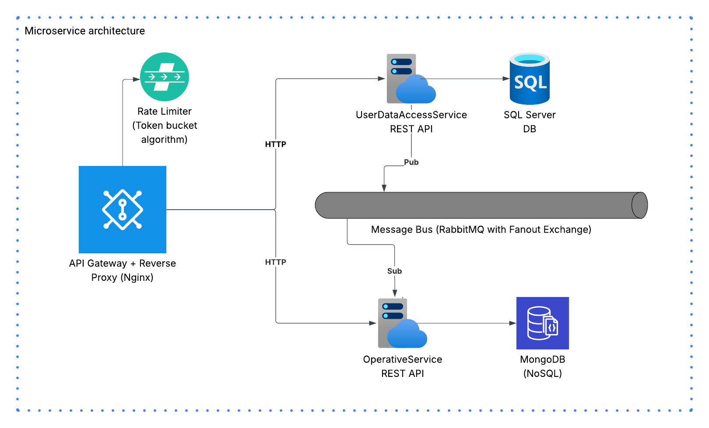

# DiceRollingMicroservices

Practical assignment from Nemetschek (ProductLab team) for the role of .NET Developer

A dice-rolling game implemented with a microservices architecture, using RabbitMQ as a message bus to synchronize databases



## Technologies

* Microservice Architecture
* ASP.NET Core Web API
* SQL Server
* Entity Framework Core
* MongoDB
* RabbitMQ message bus with Fanout Exchange
* Docker Compose
* CQRS
* MediatR
* Automapper
* JWT Authentication
* Nginx API Gateway + Reverse Proxy + Rate Limiter (Token bucket algorithm, 10 req/1 sec)

### Docker Images: 

https://hub.docker.com/r/itplamen/operativeservice/tags <br />
https://hub.docker.com/r/itplamen/userdataservice/tags

```bash
docker pull itplamen/operativeservice:1.0.0
docker pull itplamen/userdataservice:1.0.0
```

```bash
docker-compose up -d --build

# Check the status
dicerollingmicroservices-userdataservice          Built  
dicerollingmicroservices-operativeservice         Built  
Network dicerollingmicroservices_backend          Created
Volume "dicerollingmicroservices_sqlserver_data"  Created
Volume "dicerollingmicroservices_mongodb_data"    Created
Container rabbitmq                                Healthy
Container sqlserver                               Started
Container mongodb                                 Healthy
Container userdataservice                         Started
Container operativeservice                        Started
Container apigateway                              Started
```

```bash
docker-compose down -v

# Check the status
Container apigateway                              Removed
Container userdataservice                         Removed
Container operativeservice                        Removed
Container sqlserver                               Removed
Container mongodb                                 Removed
Container rabbitmq                                Removed
Volume dicerollingmicroservices_sqlserver_data    Removed
Volume dicerollingmicroservices_mongodb_data      Removed
Network dicerollingmicroservices_backend          Removed
```

# URLs:
RabbitMQ: http://localhost:15672/ <br />
UserDataAccessService API: http://localhost/users/swagger/index.html <br />
OperativeService API: http://localhost/operations/swagger/index.html
